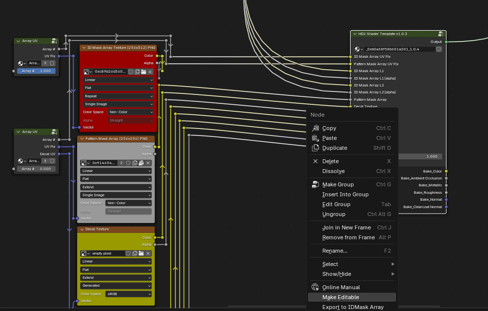
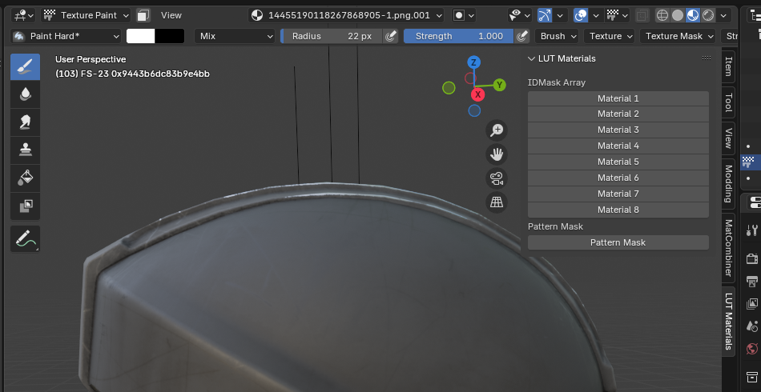
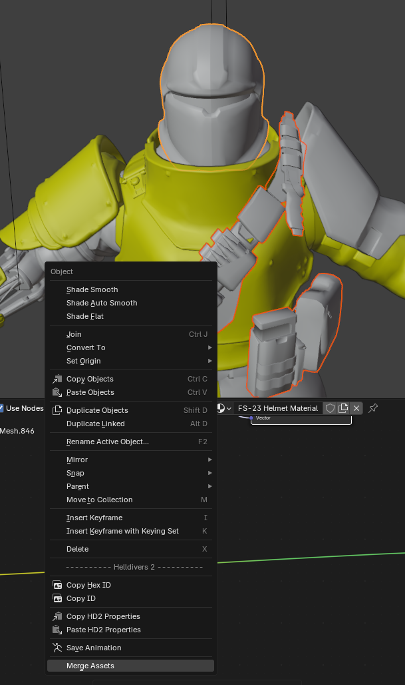
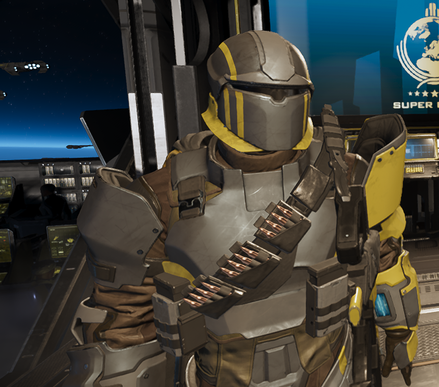
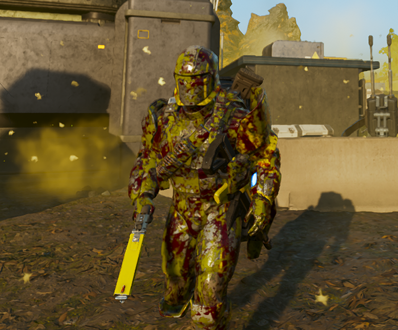

# Helldivers 2 IDMask editing

This blender addon enables the editing of the IDMask array and pattern mask texture for advanced LUT-compatible helldivers materials. 

**This add-on is for blender 4.3**. It probably also works on other versions, but that's not guarunteed. 

## Installation
1. install the pillow library to blender's bundled python env
    - Some other add-on probably already installed it. If you use Material Combiner, then that did it for you.
    - At least one of these commands I wrote will also do it: 
        - `path\to\blender.exe -b --python-expr 'import sys, subprocess; subprocess.run([sys.executable, "-m", "pip", "install", "pillow"]);'`
        - `blender -b --python-expr 'import sys, subprocess; subprocess.run([sys.executable, "-m", "pip", "install", "pillow"]);'`
2. install the addon via edit > preferences > Add-ons > Install from disk (top right)

## Setup
1. Set up the helldivers 2 accurate shader for your model
    - See [this discord thread](https://discord.com/channels/1210541115829260328/1222290154409033889) for details and a video on how to do this
    - It comes down to exporting the mesh and associated textures. Specifically, the IDMask, Pattern mask, and LUTs
    - You need to keep a hold of the IDMask dds file exported from the game. An exr file or PNG will not work for this plugin.
    - You can also append objects from the [helldivers 2 armory](https://discord.com/channels/1210541115829260328/1446534760045482046), which has this set up for each armor set
2. Modify the shader and import the IDMask dds
    1. in the node view of the shader, select and right click the main node. This will be named something like "HD2 Shader Template"
    2. Click the "Make Editable" option in the context menu.
        - Clicking this option again will give you the opportunity to import a different IDMask. The new channels will overwrite the old ones, and the shader will stay clean. This could be useful if you're painting variants.
    3. Select the IDMask array dds you exported from helldivers.
        - You do not need to pre-process this file at all. Directly exported via the sdk or filediver should be fine. IDMasks exported using this addon should also work.

Note: Once you modify the shader in step 2, then the original script that is used to "update" it will PROBABLY not work anymore. It's most likely to just shred it. Just re-creating it is probably best.

When these docs mention "The main group" or "The main node", they mean this one on the right

## Usage
### Pattern Mask Painting
#### General painting
The addon adds a toolbar accessible by pressing N in the 3d viewer in texture paint mode which allows quickly switching between materials being painted. If a material was not set up for painting, then these buttons will not be clickable. Hover over them to see why.

This addon makes painting the IDMask easier, but you do still need to know how the materials interact when layered. Luckily, you will always know what the outcome will look like as you paint.

#### Exporting
When you're done painting and ready to make a patch or otherwise use the IDMask you just painted, you'll need to export it back to a dds. It is safe to overwrite the original DDS you imported, since this add-on makes no references to it.

##### Exporting IDMask Array
1. In the shader nodes, select and right click the main group (same thing from the setup)
2. Click "Export to IDMask Array"
3. Select your output file. Existing files will be overwritten.
    - This output file can be added to a patch however you'd like

##### Exporting Pattern Mask
The pattern mask doesn't need any special treatment. Although there is a button for quickly editing it, there is no special process for exporting it. If you added it as an external file, then the changes will be saved automatically by blender when prompted. Otherwise, you'll need to unpack or directly save the image. Basically, do the inverse of however you originally added it to the accurate shader.

### Asset Merging
Objects using the accurate shader can be merged. This will atlas the ID mask arrays, pattern masks, normals, primary LUTs, and secondary LUTs of the merged objects. 
The secondary LUTs aren't useful, but they are merged anyways in case more is learned about them. These merged objects do **NOT** respect other LUT edit mods, but they will have blood and gunk visible.

| |                                   |                    |
|---|-----------------------------------|--------------------|
|  |   |   |

1. Select all objects to be merged in object mode. 
    - Each one should have ONLY the accurate shader.
    - The active object (the last object selected and highlighted orange instead of red) matters here. It should be the unit you are eventually replacing with this merged object.
    (read: the object you will be copying helldiver properties from)
2. Click "Merge assets" in the context menu
3. Select atlas output folder
    - The resultant object will appear broken in blender from this point on. Trust the process.

5 files are placed into the selected output folder, where OBJECT_NAME is the name of the active object:
- `OBJECT_NAME-idmask-atlas.dds`
- `OBJECT_NAME-normal-atlas.png`
- `OBJECT_NAME-pattern-mask-atlas.png`
- `OBJECT_NAME-lut-atlas.dds`: primary lut stack
- `OBJECT_NAME-secondary-lut-atlas.dds`: secondary lut stack (not useful for you)

4. Make a new "Armor LUT" material using the SDK and apply it to the merged object. 
    - The HD2 accurate shader material may still be on the merged object. Remove them so that the Armor LUT or other SDK materials are there.
5. Set that material's texture inputs to the corresponding atlases that were produced by step 3.
6. Copy the HD2 properties of the unit you are replacing onto the merged object, and save the unit.
7. If you are producing an armor, (you probably are) then **also** replace that armor's primary LUT with the LUT atlas in the patch, because that is hard-coded.
    - This overwrites the primary LUT for that entire armor set, and thus will affect other pieces of your armor. If you made sure that your active object selected
    in step 1 would also uses that armor's primary LUT, then the first 8 rows of the primary LUT atlas will be the armor set's entire primary LUT. The result is that 
    "dumb" armor pieces with only 8-channel IDMasks will still use only those rows, and your extra LUT rows are hidden away from them using IDMask channels they lack.
    - TL;DR: Make sure your active object in step 1 is something that already exists in the destination armor, or it will break everything sharing that LUT!

> [!NOTE]
> **Remember,** This resulting armor is *NOT* compatible with generic LUT replacement mods. It must be beneath them in the load order or otherwise overwrite them! The indicator that this is happening is one part of the armor looks fine but the rest is completely black. 
> 
> If you want your result to be visually consistent with other LUT edit mods, then you need to use the primary LUT contained in that mod when merging here instead of the LUT from the base game. I recommend distributing these as alternative "options" in your mod, should you choose to create them.

## Other Notes
- This add-on is platform-independent. I develop on linux, but windows is supported. The only platform-dependent stuff is the calls to Texassemble and LUTranslate, and the platform is detected automatically.
    - On linux, a sufficiently mature wine install and prefix should be available. If it can play a game, then it can do this. If your setup is weird, then modify the shim at `deps/texassemble` accordingly.

- Texassemble from [DirectXTex](https://github.com/microsoft/DirectXTex) is used internally. Its license is included at `deps/LICENSE`.

- Recommended commands for making a release:
    1. $`git archive HEAD -o ../IDMask-Edit.zip`
    2. unzip and re-zip the IDMask-Edit zip so that it has a parent folder in the zip

## TODO
I will accept pull requests for anything that can be justified, but these are priorities

- Add more ops so that IDMask import/export can be done from basically anywhere, rather than just via the shader nodes area. `ops/painting.py` has some code for automatically finding the main group that will help with this.

- Better support for installing pillow

- Complex Merge can be done more efficiently to produce smaller textures. Atlasing is not required.
    1. Make an LUT stack of all the constituent objects
    2. Make a unique IDMask stack for each object.
        - it should have a depth of 8*N where N is the number of objects being merged
        - For each object, the IDMask channels corresponding to the other objects need to be black. Otherwise, there will be cross-object conflicts here because of overlapping UVs.
        - Each IDMasks only need to be as deep as the last content-containing contituent IDMask. The remaining blank layers associated with other objects can be cut off. 
    3. Make an SDK material for each component object. Apply them. Assign the normals, decals, etc. accordingly.

    - Bonus points for deep SDK integration. That means creating, assigning, and populating the materials.
