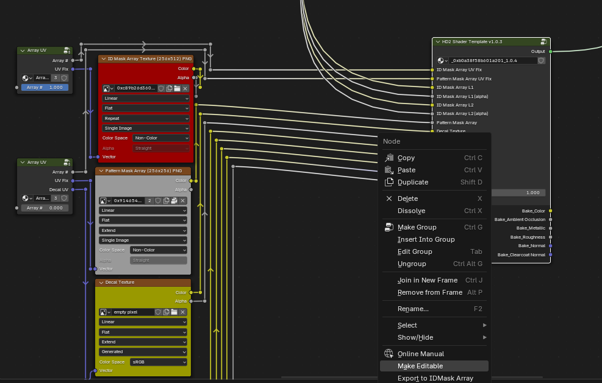
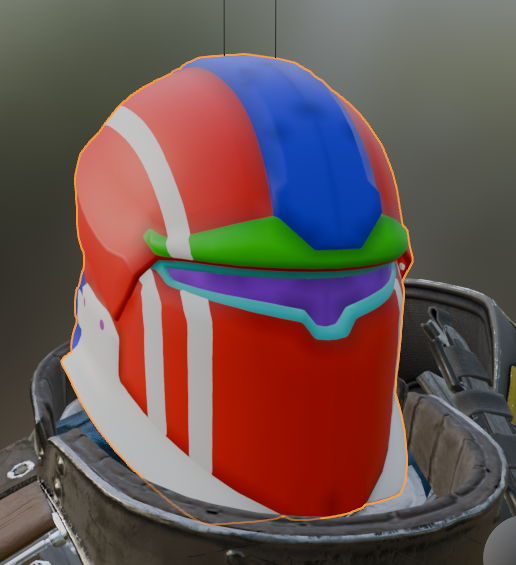
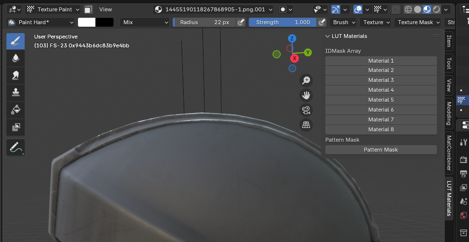
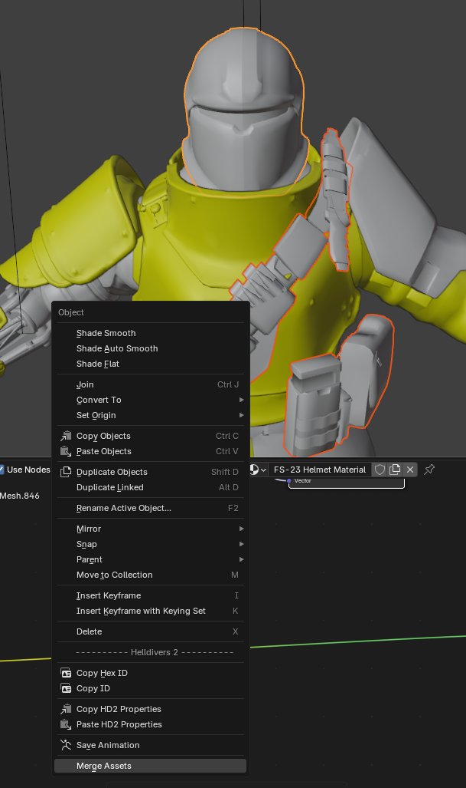
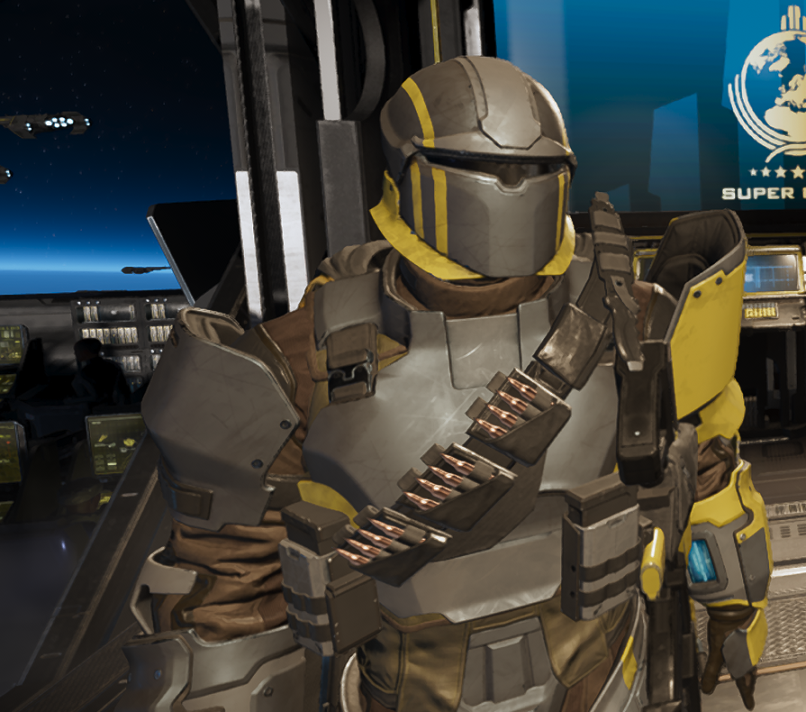
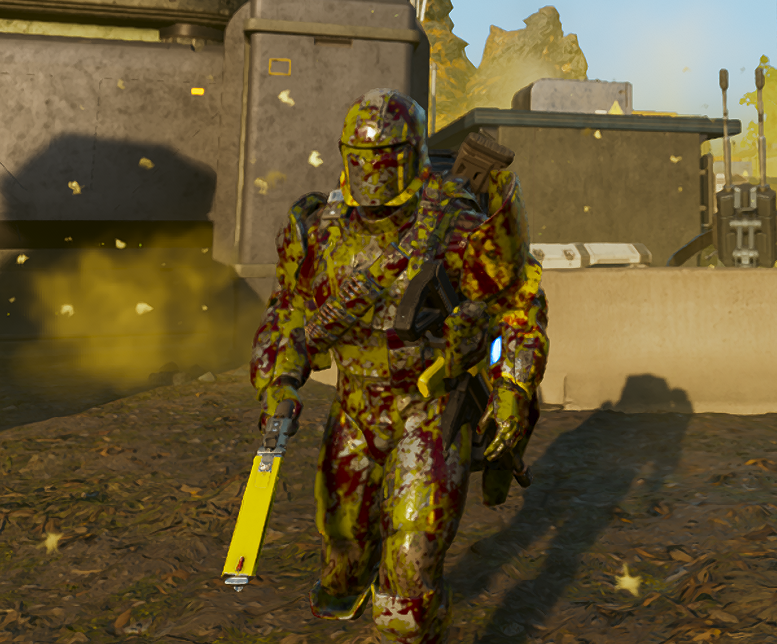

# Helldivers 2 IDMask editing

This blender addon enables the editing of the IDMask array and pattern mask texture for advanced LUT-compatible helldivers materials. 

**This add-on is for blender 4.3**. It probably also works on other versions, but that's not guarunteed. 

## Installation
1. install the [Helldivers 2 SDK](https://github.com/Boxofbiscuits97/HD2SDK-CommunityEdition)
2. download and install the [lastest release](https://github.com/ARoese/Helldivers-2-IDMask-Edit/releases) of the addon
    - Get the top-most zip file with the version in the name, NOT the respository zip
    - install via edit > preferences > Add-ons > Install from disk (top right)
3. install pillow (python library)
    - Some other add-on probably already installed it. If you use Material Combiner, then that did it for you.
    - **Automatic installation:**
        1. Press N in 3D view to open the panels tab
        2. In the "HD2 Visual Edit" group, click the "Install Pillow" button
        3. Restart blender
    - Manual installation options:
        - In the blender scripting tab, in the python repl, paste and run this command: 
            - `import sys, subprocess; subprocess.run([sys.executable, "-m", "pip", "install", "-y", "pillow"]);`
        - At least one of these cli commands I wrote will also do it: 
            - `path\to\blender.exe -b --python-expr 'import sys, subprocess; subprocess.run([sys.executable, "-m", "pip", "install", "pillow"]);'`
            - `blender -b --python-expr 'import sys, subprocess; subprocess.run([sys.executable, "-m", "pip", "install", "pillow"]);'`

## Setup
### Accurate Shader
1. Set up the helldivers 2 accurate shader for your model
    - By far, the easiest way to do this is by exporting a unit using [filediver](https://github.com/xypwn/filediver). The resulting blender object will have the shader set up for you.
    - See [this discord thread](https://discord.com/channels/1210541115829260328/1222290154409033889) for details and a video on how to do this manually
    - It comes down to exporting the mesh and associated textures. Specifically, the IDMask, Pattern mask, and LUTs
    - You can also append objects from the [helldivers 2 armory](https://discord.com/channels/1210541115829260328/1446534760045482046), which has this set up for each armor set
2. Modify the shader and import the IDMask dds
    1. in the node view of the shader, select and right click the main node. This will be named something like "HD2 Shader Template"
    2. Click the "Make Editable" option in the context menu.
        - Clicking this option again will give you the opportunity to import a different IDMask. The new channels will overwrite the old ones, and the shader will stay clean. This could be useful if you're painting variants.
    3. Select the IDMask array dds you exported from helldivers.
        - You do not need to pre-process this file at all. Directly exported via the sdk or filediver should be fine. IDMasks exported using this addon should also work.
        - If you don't have the ID mask, but have the accurate shader set up, you can save it from the shader by clicking the IDMask array image texture node, and then saving the linked image.

When these docs mention "The main group" or "The main node", they mean this one on the right

> [!WARNING]
> Once you modify the shader in step 2, then the original script that is used to "update" it will PROBABLY not work anymore. It's most likely to just shred it. Just re-creating it is probably best.

### Debug Material
  
The accurate shader can be tedious to set up, especially for custom works, so a debug material is available. This lets you paint the IDMask directly onto a model without needing to worry about setting LUTs or other textures
1. Right click the object you want to edit an ID Mask on
2. Select "Create IDMask"
    - In the bottom left, you can change the mask dimensions. This cannot be adjusted later, unless you import a mask with different dimensions.
3. If you have an existing IDMask file you would like to edit, right click the object again and click "Apply IDMask to Debug Material"
    - Right now, you need to set the pattern mask manually if you're editing. Go into the shader, and set the bottom-most texture node (connected to the "Pattern mask" debug shader group) to your external pattern mask.

> [!NOTE] 
> I recommend that you always export the IDMask whenever you're done working, even if you plan to revisit it later. The intermediate textures created and used by the plugin are easy to get mixed up, and can disappear into temporary directories if they are unpacked.
    
> [!WARNING]
> Using image dimensions that are not powers of 2 (512, 1024, 2048, etc) will crash the game when loaded. This is a general limitation of helldivers textures.

## Usage
### ID Mask Painting
#### General painting
The addon adds a toolbar accessible by pressing N in the 3d viewer in texture paint mode which allows quickly switching between materials being painted. If a material was not set up for painting, then these buttons will not be clickable. Hover over them to see why. IDMask painting is particularly fluid in the material preview rendering mode. 

When painting IDMasks, your brush should be set to either black or white. Switching between layers will set your brush to be black and white in order to enforce this. Colors make no sense in this context and will cause problems down the line. This can be unintuitive, especially in the debug material where your all-white strokes will appear colored, but it will make more sense if you think of colors as being strictly for identifying IDMask layers.

This addon makes painting the IDMask easier, but you do still need to know how the materials interact when layered. The accurate shader is very, very accurate (as expected) with this, and the debug shader does a fairly good job of approximating the interaction.

The debug material can alert you to ID Mask painting issues where it is unclear which LUT row should take priority. This can happen when two or more ID Mask layers are set to 1, and thus will clash. (usually the higher-numbered row takes priority) If you see two IDMask colors mixing to create a third color, (Red + Blue combining to make yellow) it means that those masks are equal or set to 1 at that location and should be adjusted.

#### Exporting
When you're done painting and ready to make a patch or otherwise use the IDMask you just painted, you'll need to export it back to a dds. It is safe to overwrite the original DDS you imported, since this add-on makes no references to it.

##### Exporting IDMask Array
For the HD2 accurate shader:
1. In the shader nodes, select and right click the main group (same thing from the setup)
2. Click "Export to IDMask Array"
3. Select your output file. Existing files will be overwritten.
    - This output file can be added to a patch however you'd like

For the debug IDMask material:
1. In View 3d mode, right-click the object whose mask you want to export
2. Click "Export IDMask from Debug Material"
3. Select your output file. Existing files will be overwritten.
    - This output file can be added to a patch however you'd like

##### Exporting Pattern Mask
The pattern mask doesn't need any special treatment. Although there is a button for quickly editing it, there is no special process for exporting it. If you added it as an external file, then the changes will be saved automatically by blender when prompted. Otherwise, you'll need to unpack or directly save the image. Basically, do the inverse of however you originally added it to the accurate shader.

If you are using the debug material for painting, you will need to go into the shader nodes and save the bottom-most image texture node. (The one connected to the pattern mask input)

### Asset Merging
Objects using the accurate shader can be merged. This will combine the primary and secondary LUTs of the merged objects, and stack the IDMasks to conform with those new LUTs. This is required because armor primary LUTs are hard-coded. Even when using multiple armor lut materials on a single armor, they are all hard-coded to use the same primary LUT. This merging process produces a valid shared primary LUT and IDMasks that correctly index into it.
The secondary LUTs aren't useful, but they are merged anyways in case more is learned about them. These merged objects do **NOT** respect other LUT edit mods, but they will have blood and gunk visible.

> [!TIP]
> Accurate shader materials that have been modified for IDMask painting (described in the above section) will work seamlessly here. You **DON'T** need to create a new one that used the produced dds file directly.

| |                                   |                    |
|---|-----------------------------------|--------------------|
|  |   |   |

1. Ensure a patch is active in the SDK.
    - You can click "new patch" to make a new one
2. Select all objects to be merged in object mode. 
    - Each one should have ONLY the accurate shader.
    - The active object (the last object selected and highlighted orange instead of red) matters here. It should be the unit you are eventually replacing with this merged object.
    (read: the object you will be copying helldiver properties from)
3. Click "Merge assets" in the context menu
4. Select output folder
    - The resultant object will appear black in material preview mode from this point forward. Trust the process.

> [!WARNING]
> After the merge is complete, you will not be able to edit the IDMasks and LUTs of the result using this plugin. If you make copies of the objects and merge the copies, I have seen the merge operation still end up breaking the original objects because of changes to the texture data blocks. I personally only merge as part of making a patch, and don't save the blend afterwards. Merging is quick to do, but somewhat destructive.

An SDK-compatible armor LUT material is created for each object, and the objects are merged into one. The relevant inputs are also wired up automatically. The resultant object is ready to be added to the patch.

2 files are placed into the selected output folder, where OBJECT_NAME is the name of the active object:
- `OBJECT_NAME-primary-lut-atlas.dds`: primary lut stack
- `OBJECT_NAME-secondary-lut-atlas.dds`: secondary lut stack (not useful for you)
Additionally, an id mask array is created for each merged object. They are named as `OBJECT_NAME-idmask.dds`. The armor LUT materials are automatically wired up using the textures in the accurate shader. Files were automatically converted as necessary.

5. If you are producing an armor, (you probably are) then **also** replace that armor's primary LUT with the LUT atlas (`OBJECT_NAME-primary-lut-atlas.dds`) in the patch, because that is hard-coded.
    - This overwrites the primary LUT for that entire armor set, and thus will affect other pieces of your armor. If you made sure that your active object selected
    in step 1 would also uses that armor's primary LUT, then the first 8 rows of the primary LUT atlas will be the armor set's entire primary LUT. The result is that 
    "dumb" armor pieces with only 8-channel IDMasks will still use only those rows, and your extra LUT rows are hidden away from them using IDMask channels they lack.
    - TL;DR: Make sure your active object in step 1 is something that already exists in the destination armor, or it will break everything sharing that LUT!

> [!NOTE]
> **Remember,** This resulting armor is *NOT* compatible with generic LUT replacement mods. It must be beneath them in the load order or otherwise overwrite them! The indicator that this is happening is one part of the armor looks fine but the rest is completely black. 
> 
> If you want your result to be visually consistent with other LUT edit mods, then you need to use the primary LUT contained in that mod when merging here instead of the LUT from the base game. I recommend distributing these as alternative "options" in your mod, should you choose to create them.

## Known Issues
- If any of the relevant textures is a data block with a broken link, (it is an external or linked image, and that link is broken) then blender will hang and just eat ram. This can happen sometimes when using arsenal shaders that have been appended from another blend file. If your material looks broken, then merging with it might fail!
- Performing the merge operation on copies of objects can break the originals. This obstructs a workflow that involves merging once and just always adding that to the patch while maintaining un-merged copies of the constituent objects in case changes want to be made later. My recommendation is to use asset merging as a step of making your patch, which will be intentionally not saved.

## Reporting Issues
If you encounter issues or need help, you can either open an issue on github or contact me (@DrLong) in the [Helldivers 2 Modding Community discord server](https://discord.gg/ZwjPaZNwH7).

## Other Notes
- This add-on is platform-independent. I develop on linux, but windows is supported. The only platform-dependent stuff is the calls to Texassemble, Texconv, and LUTranslate, and the platform is detected automatically.
    - On linux, a sufficiently mature wine install and prefix should be available. If it can play a game, then it can do this. If your setup is weird, then modify the shims at `deps` accordingly.

- Texassemble and Texconv from [DirectXTex](https://github.com/microsoft/DirectXTex) are used internally. Their license is included at `deps/LICENSE`.

- Recommended commands for making a release:
    1. $`git archive HEAD -o ../IDMask-Edit.zip`
    2. unzip and re-zip the IDMask-Edit zip so that it has a parent folder in the zip

    - Or run `make_release.sh`

## TODO
I will accept pull requests for anything that can be justified, but these are priorities

- Add more ops so that IDMask import/export can be done from basically anywhere, rather than just via the shader nodes area. `ops/painting.py` has some code for automatically finding the main group that will help with this.
- better pattern mask support in the debug shader. Right now, the pattern mask needs to be set and saved manually via the nodes, and this isn't really clean.
- IDMask import/export that creates a signed distance field according to [this paper](https://steamcdn-a.akamaihd.net/apps/valve/2007/SIGGRAPH2007_AlphaTestedMagnification.pdf) and downscales that to create the actual IDMask. Also support importing from an SDF to a high-resolution binary image that gets edited. Use bilinear interpolation as suggested in the paper. This makes it easier to edit fine details without needing to eyeball the SDF or export unnecessarily high resolution ID masks.
